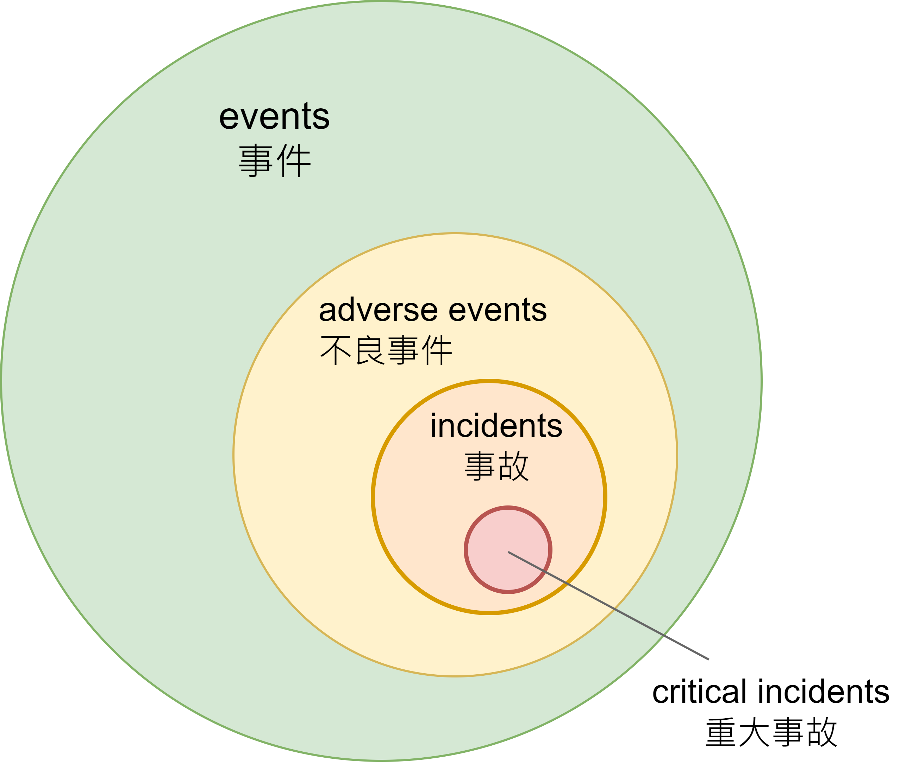

## 資安事件？資安事故？如何

>“馬者，所以命形也。白者，所以命色也。命色者，非命形也，故曰白馬非馬。”  
>公孫龍（320 B.C.－250 B.C.）

1. **事件**：在系統或網路中所發生任何可被觀察到的活動或情況。例如員工寄送email, 用戶登入時密碼錯誤、防火牆阻擋某個IP、路由器或交換器的ACL更新等。

2. **不良事件**：具有負面效應的事件；例如系統當機、封包氾濫(packet flood)、DNS主機遭DDoS攻擊等事件，但不包括與電腦系統無關的因素，例如天然災害、停電等。

3. **事故**：造成實際損害，或極有可能造成損害的不良事件。這些損害主要聚焦在機密性、完整性及可用性，例如系統遭植入惡意軟體、網站內容被竄改等。

4. **重大事故**：對業務營運造成影響的事故。例如資料被勒索軟體加密，導致業務停頓，或是電子商務網站無法下單等。

在我看來，這在大多數組織中太常見了，不切實際。 在決定使用多寬或多窄的定義時，請考慮所有事件都應產生 IR 響應。 如果您因為每天或每周有成千上萬或數百萬個這樣的人而無法做到這一點，請相應地調整您的定義。

